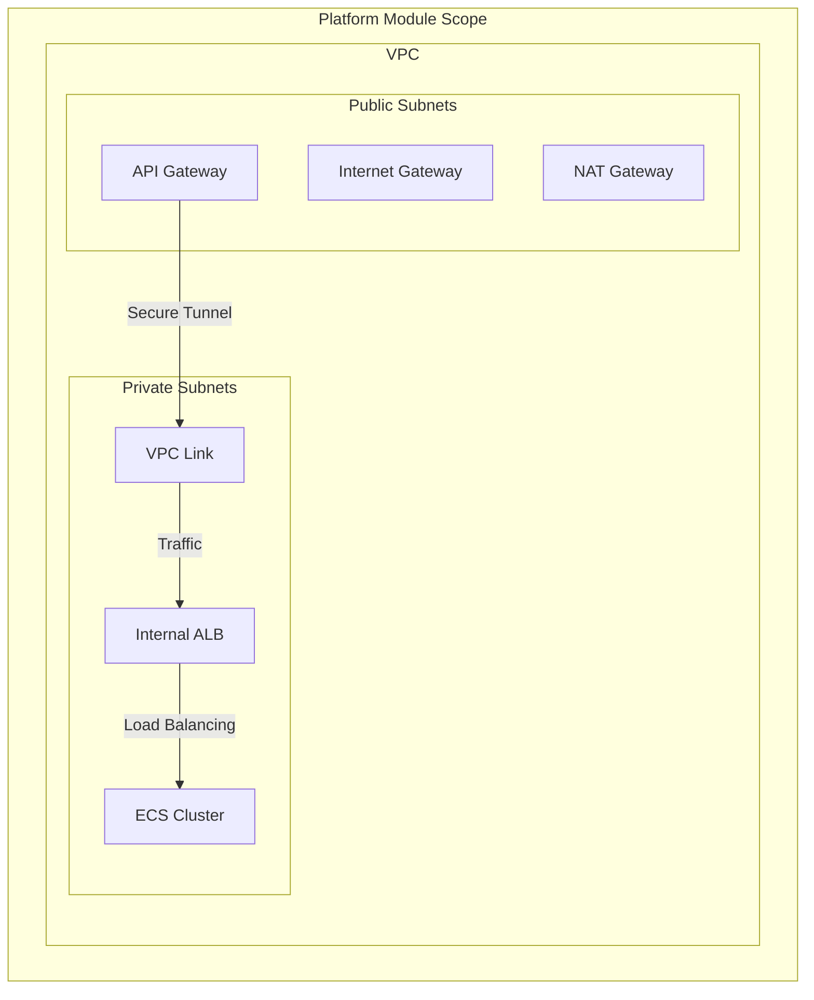

# terraform-aws-fargate-platform

## Purpose

This module provisions the **shared foundational infrastructure** required to run all microservices in the Fargate/VPC Link pattern. It defines the network and control plane, strictly adhering to governance standards.

This module is designed to be provisioned **once per environment** (e.g., staging, production) and its outputs are consumed by the service deployment modules (`terraform-aws-fargate-service`).

## 🛡️ Governance and Security Highlights

* **VPC and Subnets:** Creates a dedicated VPC with isolated Public (for NAT Gateway) and Private (for application tasks) subnets.
* **Internal Load Balancer:** The ALB is provisioned as **internal** and placed in **private subnets**, ensuring no direct public access.
* **API Gateway:** Serves as the single, public point of entry for all traffic.
* **VPC Link:** Establishes the secure, private bridge between the public API Gateway and the internal network.



## 💡 Outputs (The Contract)

The primary function of this module is to generate the following outputs, which are mandatory inputs for the service module:

| Output Name | Purpose | Consumed by Service Module as... |
| :--- | :--- | :--- |
| `vpc_id`, `private_subnet_ids` | Networking context. | `vpc_id`, `private_subnet_ids` |
| `ecs_cluster_id` | Placement for Fargate tasks. | `ecs_cluster_id` |
| `alb_listener_arn` | Target for new service routing rules. | `alb_listener_arn` |
| `api_gateway_id`, `vpc_link_id` | Routing targets for public exposure. | `api_gateway_id`, `vpc_link_id` |

| `api_gateway_id`, `vpc_link_id` | Routing targets for public exposure. | `api_gateway_id`, `vpc_link_id` |
| `internal_alb_dns_name` | DNS name of the internal ALB. | N/A |

## 🔧 Configuration

You can toggle specific components to optimize for cost or specific workload types (e.g., Lambda-only).

| Variable | Type | Default | Description |
| :--- | :--- | :--- | :--- |
| `enable_ecs` | `bool` | `true` | Provisions ECS Cluster and Security Groups. |
| `enable_alb` | `bool` | `true` | Provisions Internal ALB and VPC Link. |
| `enable_nat_gateway` | `bool` | `true` | Provisions NAT Gateway for private subnet internet access. |

### ⚡ Lambda-Only Mode

To deploy a lightweight, low-cost environment for Lambda services (no containers), disable the "heavy" components:

```hcl
module "platform" {
  # ...
  enable_ecs         = false
  enable_alb         = false
  enable_nat_gateway = false # Optional: Keep true if Lambdas need internet
}
```

> **Note:** In this mode, `ecs_cluster_id`, `alb_listener_arn`, and `vpc_link_id` will be `null`.

## ⚙️ Usage (For Reference)

This module should be called from your environment configuration (e.g., `prod-config/main.tf`):

```terraform
module "platform" {
  source  = "[github.com/your-org/terraform-aws-fargate-platform](https://github.com/your-org/terraform-aws-fargate-platform)"
  version = "v1.0.0"

  project_name        = "acme-widgets"
  environment         = "prod"
  aws_region          = "us-east-1"
  vpc_cidr_block      = "10.0.0.0/16"
  availability_zones  = 2
}
